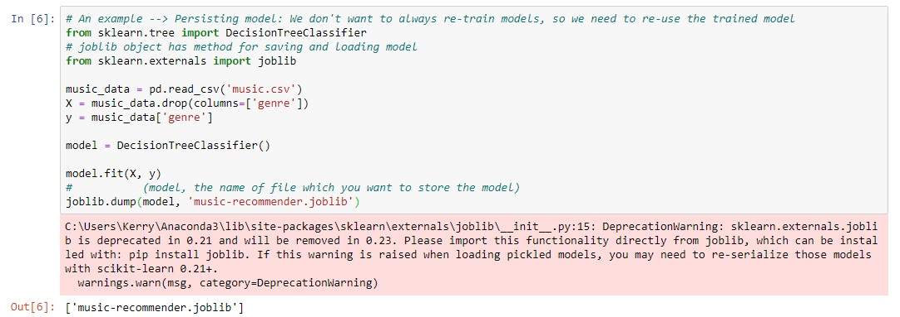

# Basic Machine Learning: Decision Tree

### All the files you created above (.joblib and .dot) will reflect at your jupyter files page, for my example is located at my Desktop 

### Now, go to VsCode install the Graphviz(dot) extension to open .dot file

### You can now visualize Decision Tree

